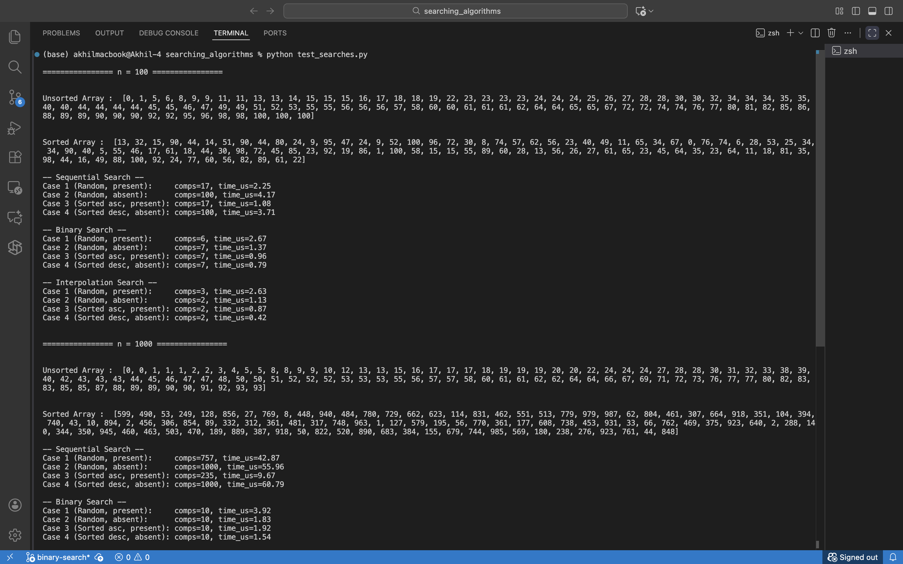
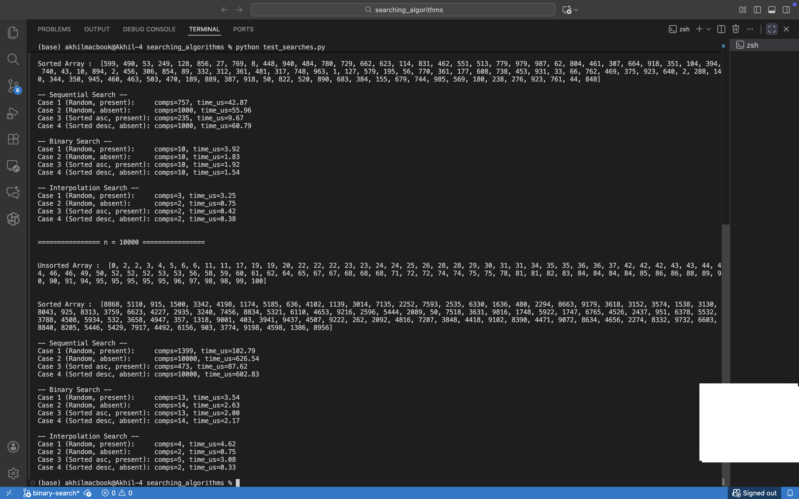

# Searching Algorithms

Small collection of scripts for preparing random integer arrays and running
sequential, binary, and interpolation search comparisons.

## Requirements
- Python 3.10+ 

## Getting Started
1. Clone or download the repository and open a terminal in the project folder.
2. (Optional) Create a virtual environment with `python -m venv .venv && source .venv/bin/activate`.
3. Run all experiments with:
   ```bash
   python test_searches.py
   ```
   This generates arrays of several sizes and prints timing/comparison stats for each algorithm.

## Running a Single Search
Each search script accepts four arguments:
`python <script> <array_size> <key> <random|sorted> [descending]`

Example (sequential search on an unsorted array of 1000 elements looking for the value 42):
```bash
python sequential_search.py 1000 42 random
```

Example (binary search on a descending sorted array of 5000 elements looking for the value 123):
```bash
python binarysearch.py 5000 123 sorted true
```

The scripts print the generated arrays (truncated) along with whether the key was found, how many comparisons were needed, and the execution time in microseconds.

## Update Hook Output
Screenshots captured after running `python test_searches.py`.




## Author
- Akhil Ramakrishna
- Jaskirat Singh Sudan
